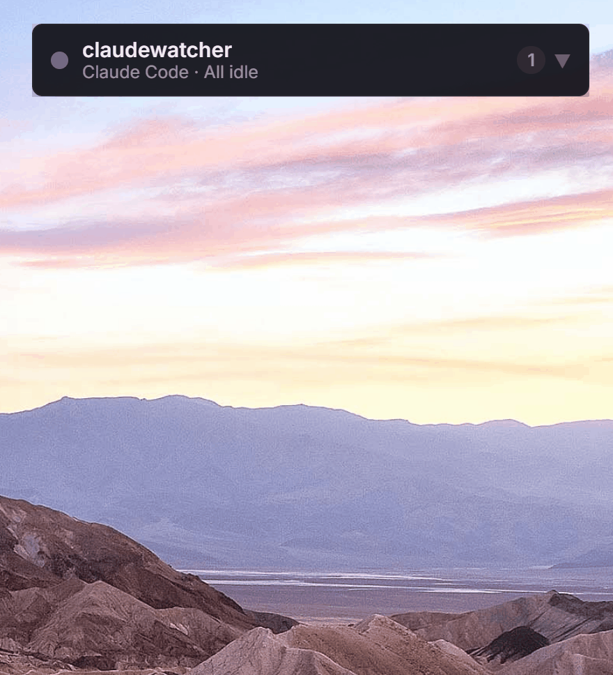

# ding

**A floating permission monitor for Claude Code.**

ding keeps Claude Code's native terminal UI intact, while a small always-on-top window watches for tool activity, permission prompts, and user-input requests.

Have you ever left Claude Code running in the background, only to find out much later that it was stuck on a permission-required prompt from a compound command?

With ding, you can keep vibecoding while watching YouTube, reading docs, or working in another window. If Claude Code needs your permission, a choice, or any other blocking action, ding floats above your workspace and tells you immediately.

## Demos

### Permission required

Claude Code asks to run a command. ding switches to `Action needed`, mirrors the permission choices, and lets you approve from the floating window.

<p align="center">
  
</p>

### AskUserQuestion mirrored

When Claude Code asks you to choose from multiple options, ding shows those real choices instead of replacing them with generic Allow/Deny buttons.

<p align="center">
  
</p>

### Multi-instance monitoring

Run several Claude Code sessions at the same time. ding aggregates status, tool activity, and action-required counts in one floating monitor.

<p align="center">
  
</p>

See [the recording guide](assets/demo/RECORDING_GUIDE.md) for exact scripts, prompts, and capture settings.

## What ding Does

- Starts Claude Code with `ding claude`.
- Preserves Claude Code's native TUI behavior.
- Shows an always-on-top floating status window.
- Displays the current Claude Code tool, such as `Bash`, `Edit`, or `AskUserQuestion`.
- Alerts you when Claude Code needs permission or user input.
- Mirrors Claude Code permission choices, including allow, deny, and always-allow options.
- Mirrors Claude Code question choices instead of replacing them with generic approval buttons.
- Lets you close ding from the floating window's right-click menu.

## Install

ding is currently packaged for Windows.

Download the latest release from GitHub Releases:

```text
ding_0.1.0_x64-setup.exe
```

Alternative MSI package:

```text
ding_0.1.0_x64_en-US.msi
```

After installing, make sure `ding.exe` is available in your `PATH`.

## Requirements

- Windows 10 or Windows 11.
- Claude Code installed and available as `claude`.
- A working Claude Code authentication setup.

Check Claude Code first:

```powershell
claude --version
```

## Usage

Start Claude Code through ding:

```powershell
ding claude
```

You can pass normal Claude Code arguments:

```powershell
ding claude --permission-mode default
```

On first run, ding will:

1. Start the floating monitor if it is not already running.
2. Install or update ding's Claude Code hooks in your user-level Claude settings.
3. Launch the native Claude Code TUI in the current terminal.

Running `claude` directly still behaves normally and does not activate ding monitoring. ding hooks only activate for sessions launched with:

```powershell
ding claude
```

## Why This Matters

Claude Code can pause on prompts like:

```text
Do you want to proceed?
1. Yes
2. Yes, and always allow access to this project
3. No
```

This is easy to miss when Claude Code is running behind another window. It is especially frustrating when a long-running task stops because a compound command triggered a permission prompt.

ding makes those pauses visible.

You can approve, deny, or answer directly from the floating window, then go back to whatever you were doing.

## Closing ding

Right-click the floating window and choose:

```text
close ding
```

## Troubleshooting

### `ding` is not recognized

Add the ding installation directory to your user `PATH`, then open a new terminal.

### Claude Code starts, but ding does not show activity

Run `ding claude` once from the installed ding path. This refreshes the Claude Code hook commands to point at the installed `ding.exe`.

### You see `localhost refused to connect`

You are probably running a development/debug build directly:

```powershell
src-tauri\target\debug\ding.exe
```

Use the formal release installer instead. The product build does not depend on `localhost` or a Vite dev server.
