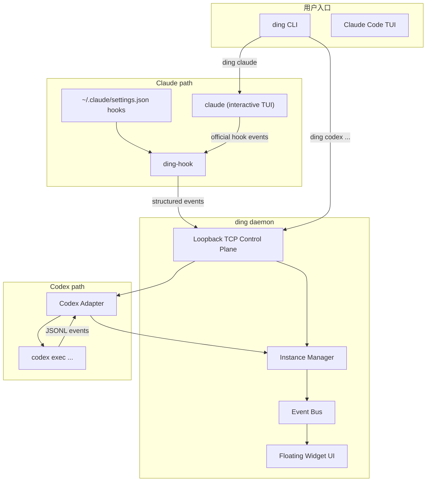

# `ding` 技术方案（当前基线）

更新时间：2026-04-10

> 本文是当前唯一有效的总体方案。  
> 旧的 Claude `-p --output-format stream-json` 非交互方案不再作为后续实现方向。

---

## 1. 产品目标

`ding` 是一个桌面悬浮监控器，用来观察和干预 AI Agent 会话。

当前明确目标：

- `ding claude` 启动后，当前终端中的 Claude Code 行为必须与直接在当前目录运行 `claude` 保持一致
- `ding` 对 Claude 的监控来自官方 hooks，而不是 `stream-json`
- `ding` 通过用户级 hooks 安装，使之后直接运行 `claude` 也默认带上 `ding` 监控
- `ding` 保留悬浮窗、审批、关键日志、实例列表等桌面能力
- Codex 仍保留现有结构化监控路径，但暂不要求交互式 TUI 与细粒度监控并存

---

## 2. 当前结论

### 2.1 Claude 的唯一主线

Claude 后续实现以以下方案为准：

- 交互式 Claude TUI
- 用户级 hooks
- 用户级 hook relay 入口作为结构化事件桥接器
- `session_id` 作为实例主键

明确不再作为主线的旧方案：

- `claude -p <prompt> --output-format stream-json`
- 依赖 stdout NDJSON 解析 Claude 会话状态
- 把 `ding claude <prompt>` 作为主要交互入口

### 2.2 Codex 的当前定位

Codex 当前仍按“结构化事件流 + daemon 控制面”方向演进：

- `codex exec ...`
- JSONL 事件解析
- 审批事件和状态监控

是否支持 Codex 原生交互式 TUI，不在当前第一阶段范围内。

### 2.3 daemon 控制面

当前 daemon 控制面以本地 loopback TCP 为准，而不是此前文档中的 control pipe。

用途：

- `ding list`
- `ding kill`
- `ding codex`
- `ding run`
- `ding-hook` 与本地 daemon 的事件通讯

Claude hooks 内部若仍需要专用拦截通道，可继续单独使用 hook 级别的 pipe 或本地 socket，但这不再是全局控制面的主设计。

---

## 3. 总体架构

---

## 4. Claude 方案

Claude 交互式方案的详细事件范围和状态映射以 [claude_hooks_mvp.md](/D:/code/claudewatcher/docs/claude_hooks_mvp.md) 为准。

这里仅保留总原则。

### 4.1 启动行为

`ding claude` 的行为必须满足：

- 当前工作目录不变
- 当前终端交互体验与直接执行 `claude` 一致
- 不自动注入 prompt
- 不切换到非交互模式

### 4.2 hooks 安装策略

`ding` 负责维护用户级 Claude hooks 配置：

- 配置文件：`~/.claude/settings.json`
- 只管理 `ding` 自己的 hook 条目
- 不覆盖用户已有的非 `ding` hooks
- 幂等更新
- 支持后续卸载或禁用

### 4.3 事件桥接

当前实现中，Claude hooks 通过 `ding` 主二进制的隐藏子命令 `hook-relay` 回传事件。

这一层的职责：

- 从 Claude hooks 的 `stdin` 读取 JSON 事件
- 把事件发给本地 daemon
- 在需要人工决策时阻塞等待 `ding` UI 返回审批结果

备注：

- 仓库中仍保留 `ding-hook` 二进制，但当前用户级 hooks 安装路径已先落在 `ding.exe hook-relay <EventName>`
- 只要行为一致，后续是否重新抽成独立 `ding-hook` 二进制不影响产品方向

### 4.4 实例识别

Claude 会话不再依赖一次性临时环境变量绑定实例。

实例归属规则：

- 以 `session_id` 作为主键
- daemon 中不存在该会话时自动创建实例
- 通过 hook 事件持续更新该实例

### 4.5 Claude MVP 范围

第一阶段接入的官方 hooks 事件：

- `SessionStart`
- `PreToolUse`
- `PostToolUse`
- `Notification`
- `Stop`
- `SubagentStop`
- `SessionEnd`

子代理扩展事件作为第二层增量：

- `SubagentStart`
- `SubagentStop`
- `TaskCreated`
- `TaskCompleted`

---

## 5. Codex 方案

Codex 当前仍按结构化执行模式处理，不与 Claude 方案混用。

当前方向：

- `ding codex ...` 通过 daemon 启动 `codex exec`
- 解析 JSONL 事件
- 驱动实例状态、审批、日志

待完成事项包括：

- Codex 可执行文件定位与错误提示
- 审批回传闭环
- `apply_patch` diff 预览
- kill 真正结束底层进程

---

## 6. UI 要求

悬浮窗继续沿用既有产品目标：

- 胶囊态显示全局最高优先级实例
- 面板态展示多实例列表
- 审批卡片用于可视化确认/拒绝
- 日志区域显示关键事件

但要注意：

- Claude 交互式 TUI 下，`thinking` 这类细粒度状态可能只能通过 hooks 和推断层近似得到
- UI 设计不能假设 Claude 一定会提供连续的 assistant 文本流
- 当前审批主线是 `PreToolUse -> ding UI -> hook JSON decision`

---

## 7. 当前实施顺序

### Phase A：基础控制面

- Tauri UI
- daemon 控制面
- 实例模型与事件总线
- `ding list`

### Phase B：Claude Hooks MVP

- 用户级 hooks 安装
- `ding claude` 原生交互启动
- 用户级 hook relay 入口稳定化
- `session_id` 实例识别
- 审批 UI 回传

### Phase C：Codex 结构化监控补完

- 可执行文件解析
- 审批闭环
- kill 真正结束进程
- 更完整的 diff 预览

### Phase D：体验打磨

- 提示音
- 托盘
- 更稳定的状态推断
- 子代理可视化

---

## 8. 文档关系

后续实现请按以下文档优先级理解：

1. 本文：总体基线
2. [claude_hooks_mvp.md](/D:/code/claudewatcher/docs/claude_hooks_mvp.md)：Claude 第一阶段详细范围
3. [task.md](/D:/code/claudewatcher/docs/task.md)：开发进度清单
4. [review_issue_list.md](/D:/code/claudewatcher/docs/review_issue_list.md)：当前问题清单

如果其他旧文档内容与本文冲突，以本文为准。
